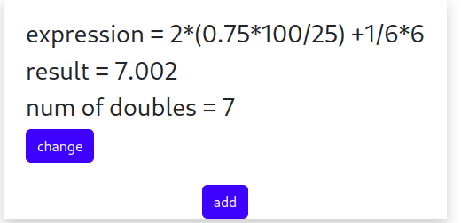
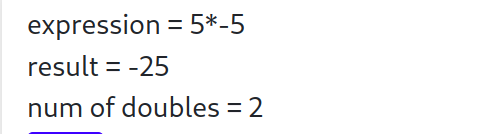
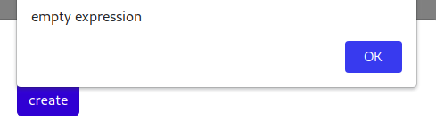
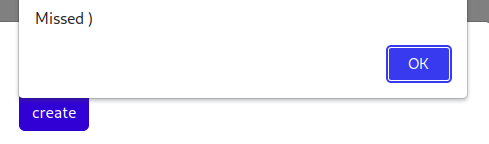
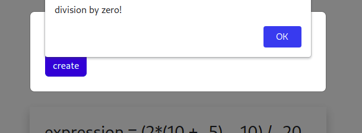
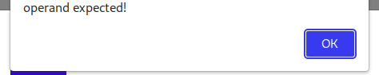
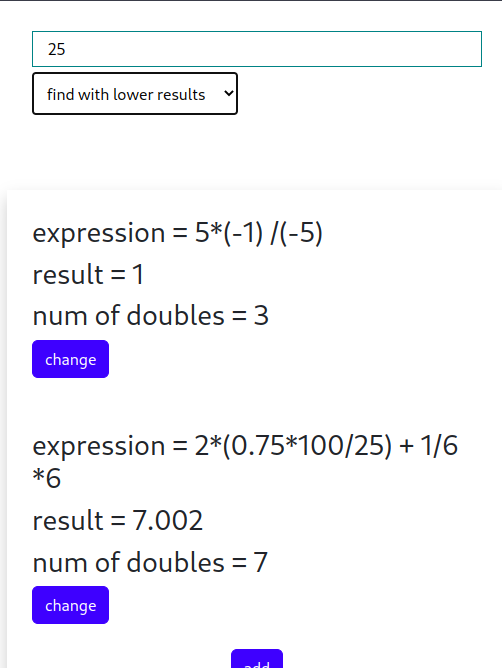

# ArithmeticEvaluator
<h2> Description </h2>

This program is dedicated to evaluate arithmetic expressions and obtain the amount of numbers in expression. If the given expression is correct, it will be saved to database. It also gives an opportunity to get expressions containing results equal to (higher / lower than) results recieved from database.

 

This is RESTful java Spring Boot application wich implements entity Expression with fields - arithmeticExpression, result and numOfDoubles. If recieved expression is correct, it`ll be saved to database. If expression is empty or incorrect, application will return error message with exception type (message) and exception message (debugMessage).
 

  
 

Samples of incorrect expressions - empty expressions and expressions with no values in brackets (e. g. "2 + ()"), expressions with missed brackets (e. g. "2+2)"), expressions containing letters, expressions containing numbers started with '.' (e. g. "2 + .2"). Expressions with incorect operators sequence are also incorrect (e. g. "2-*2", but "2* -2" is correct), expressions containing division by zero.
If expression is incorrect, the program returns an error message.
 

 

Samples of correct expressions - "2*((2+2))" is same as "2*(2+2)", "2+	2" is equal to "2+2".

<h2>Used Technologies:</h2>
 

 Back-end: Spring Boot, Spring Web, Spring Data JPA, MariaDB, Lombok.
  

  

 Front-end: ReactJS.
 

 

  Server Build: Maven.
  

  

 Client Build: npm.
 

 <h2> Requirements:</h2>
 
 Java 17 

 
 MariaDB 

 
 Maven 

 <h2>Run:</h2> 
  

    
go to the project directory.
      
run: mvn clean package

      
then: java -jar target/myTestApp-0.0.1-SNAPSHOT.jar

      
go to the *project directory*/react/evaluator

      
run: npm install

      
then: npm start

  

  
You also need to provide acces to your MariaDB database. 

  
You must set your database url, password and username to *project directory*/src/main/resources/application.properties file and to *project directory*/src/test/resources/test.properties 

  <h2> adding expressions examples </h2>
 

 

  
  <h3> adding expression </h3>
  
  <h3> result (is rounded to three decimal places)</h3>
 

   
 

  
  <h3> adding expression </h3>
  
  <h3> result</h3>
 

 

  
 <h2> Examples of incorrect expressions </h2>
 

 

  
  <h3> adding empty expression </h3>
  
  <h3> result </h3>
 

   
 

  
  <h3> adding expression with missed bracket </h3>
  
  <h3> result </h3>
 

   
   

  
  <h3> adding expression with division by zero </h3>
  
  <h3> result </h3>
 

  
   

  
  <h3> adding expression with bad operands </h3>
  
  <h3> result </h3>
 

 

  
 <h2> Getting expressions from db examples </h2>
  

  
  <h3> get expressions containing same result </h3>
  
   <h3> get expressions containing higher results </h3>
   
   <h3> get expressions containing lower results </h3>
 

 <h2> Changing expressions examples </h2>
 

  

  
   <h3> setting new values </h3>
    
   <h3> result </h3>
 

 

 
 
